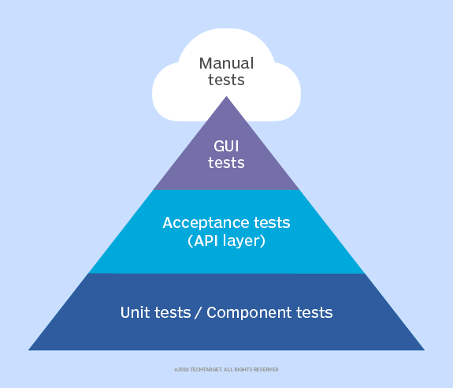
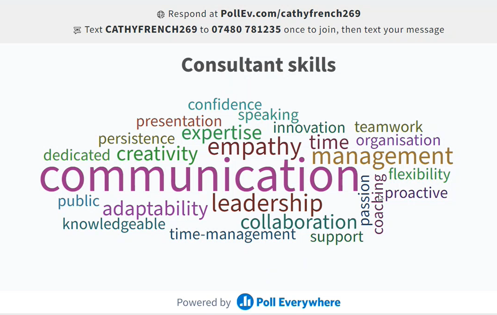

# Week 1 - Induction - Day 1

[Back](/Week_1)

[Main Menu](/README.md)

---

Date: 6/27

## Introduction to C# SDET

### Why C#?

- Popularity
    - open source
    - developed by Microsoft
    - excellent integration
    - a huge list of libraries

- Industry applications
    - web:  ASP.NET
    - desktop: WPF
    - data: LINQ

### SDET
- a mix between software developer and tester

### Testing pyramid

## Introduction to Sparta Global

### Objectives

- Welcome
- Who is Sparta? 
- The Spartan Experience 
- The Why? 
- The Week Ahead A Day in the Academy
- Icebreaker 
- Tooling 
- Class Rules
- Training Journey 
- Spartan Journey 
    - 8-week training
    - pre-assignment
    - 2 years on site
        - 6 month: probation
        - 12 month: milestone review
        - 18 month: options
        - 24 month:  junior consultant to consultant
- Skills 
    - 70% consultant
    - 30% technical
- Sparta Behaviours 
    - delivery
    - engagement
    - professionalism
    - communication
- Red Flags 
- Personal Development 
    - talent selection process
    - presentations
    - independent and group work
    - projects
    - trainer feedback
        - 3 one-to-ones during the training
    - quality gate
    - self-reflection

