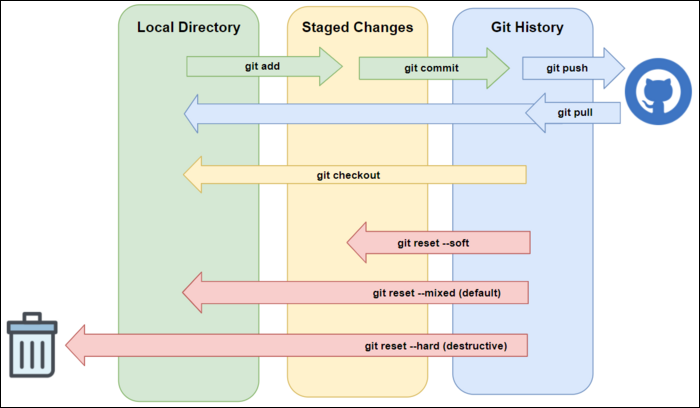
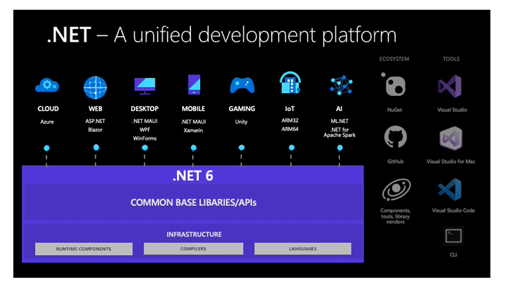

# Week 1 - Induction - Day 3

[Back](/Week_1)

[Main Menu](/README.md)

---

Date: 6/29

## MarkDown
- Aaron Swartz

Commands | Description
- |
#, ##, ### … | title, sub-title, sub-sub-title ...
\* … * | italic
** … ** | bold
*** … *** | italic + bold
\>, >>, >>>, … | reply
\[…](https://...) | hyperlink
\!\[…](https://…) | attach image
\!\[…](.\Example.jpg) | attach local image
\[…](#…-…-…) | link to header (kebab case)
\- … | bullet points
\- [ ] … | tick box
\- [x] … | 
\``` | code block
\```csharp | specify language 
\``` | 
\`…` | highlight
… \| … \| … | table
\- \| | bold table headers

## Mermaid

Command | Description
-|
flowchart LR | flow chart
a[start] -->\|to\| b(finish) | flow chart:  pointers
b --> c{decision} | flow chart:  pointers
statediagram | state diagram
[*] --> HomePage | state diagram:  pointers
pie | pie chart
"Python": 1 | pie chart: attributes

## Shells and scripting


Shells vs GUI

Linux Bash, Git Bash
Windows PowerShell vs command prompt
- similar to Linux Bash
- can interact with .NET objects (?) (2:46)

### PowerShell

Command | Description
-|
ls | list files
ls - R | list files, recursive, list what's within the folders as well
dir | directory
history | history
cd \ | top of tree folder
cd .. | change directory, go back one directory
cd desktop | change directory, within folder
cd "C:\Users\user" | 
cd ~ | home
mkdir newpath | make directory
md newpath | 
notepad TestFile.txt | open file with notepad
cat testfile.txt | concatonate and print content
gc testfile.txt | get content
cp testfile.txt subfolder | copy
mv testfile.txt hello.txt | move or rename file
rm testfile.txt | remove
del testfile.txt | delete
help ls | 
ctr + c | get out
get-alias | 
get-command | 
new-item myFile.txt | create a new file
echo "hi" | print string
echo "Nish" >> myFile.txt | append new lines to file; if file doesn't exist, it will be created
echo "Nish" > myFile.txt | overwrite

### PowerShell ISE (integrated scripting environment)

Command | Description
-|
get-command * > PowerShell-commands.txt | 
get-command \*dns* \| Out-GridView | dns = Domain Name System
get-process | 
get-process \| select name,cpu \|sort cpu \| out-gridview | \| to separate the commands

#### Batch file

Command | Description
-|
notepad PowerShellScript.ps1 | open PowerShellScript.ps1 in notepad

```powershell
echo "This is a hello world batch file"
if(Get-Item -Path FolderA -ErrorAction Ignore) {
    echo "Folder already exists"
} else {
    echo "Creating folder"
    md FolderA
}
cd FolderA
echo "Hello World" > testfile.txt
echo "Hope you're cool" >> testfile.txt
echo Another line without quotes >> testfile.txt
echo "File contents after appending text"
cat testfile.txt

echo "Adding Content" > testfile.txt
echo "File after writing over"
cat testfile.txt
cd ..

```

#### Execution policy

Command | Description
-|
./PowerShellScript.ps1 | run script
get-ExcecutionPolicy | 
set-ExecutionPolicy -scope process -executionPolicy unrestricted | 
set-ExecutionPolicy -scope process -executionPolicy allsigned | 

## Git Hub

gitignore,Tortoise Git

### To add, commit, and push changes
Command | Description
- | 
git clone https://github.com/nishman89/Engineering120 | 
git status | 
git add readme.md | 
git add . | 1. add files to your local repository and stage it for commit
git commit --m "Updated README.md file" | 1. commit tracked changes and prepare them to be pushed to remote repository
git status | origin/main = remote repository
git push | 1. push tracked changes to remote repository

### To unstage and uncommit changes
Command | Description
- | 
git log | show history of commits
git log --pretty=oneline | condensed log, check commit IDs
git diff commit_ID1 commit_ID2 | show difference between commits
git reset HEAD | unadd and unstage tracked changes
git reset --soft commit_ID | uncommit back to commit_ID, local files not changed
git reset --hard commit_ID | uncommit back to commit_ID, change local files
cat readme.md | concatonate



### Sematic versioning
- major . minor . patch
- ex.  4.2.1

Tag
- a completed stage of the project ready to be downloaded

Command | Description
- | 
git add . | 
git commit --m "Updated readme" | 
git tag -a 1.0.1 -m "Chorus is complete" | 
git tag -d 1.0.1 | delete tag
git log --pretty=oneline | tag is shown
git push origin --tags | origin:  online repository
git tag | show version


## C# and .NET

### Butler analogy

- butler of C# is more strict
- trade-off between
    - flexibility and runtime
    - ease of programming and control

### Timeline

Year | Event
-|
1972 | C
1979 | "C with classes"
1985 | “The C++ Programming Language" published
1995 | Java 1.0 - memory management, JVM
1999 | Microsoft started developing "Cool" - C like Object Oriented Language
2002 | C# 1.0 with .NET framework 1.0 and Visual Studio .NET 2002 – similar to Java
2007 | C# 3.0 -  new features including LINQ
2012 | C# 5.0 - asynchronous programming support
2014 | .NET Core announced - cross-platform
2016 | .NET Core 1.0
2017 | .NET Core 2.0
2019 | .NET Core 3
2020 | .NET 5.0 and C# 9.0
2021 | .NET 6.0 and C# 10.0





### .NET development frameworks
- desktop applications
    - Windows Presentation Foundations (WPF)
    - Windows Forms
- Universal Windows Platform (UWP)
    - cross-platform
    - deploy in Windows store
- Entity Framework
    - interface between C# and relational database
- ASP.NET
    - an extended version of .NET for building web applications
- Xamarin
    - building apps for iOS, Android, Windows, Mac

---

