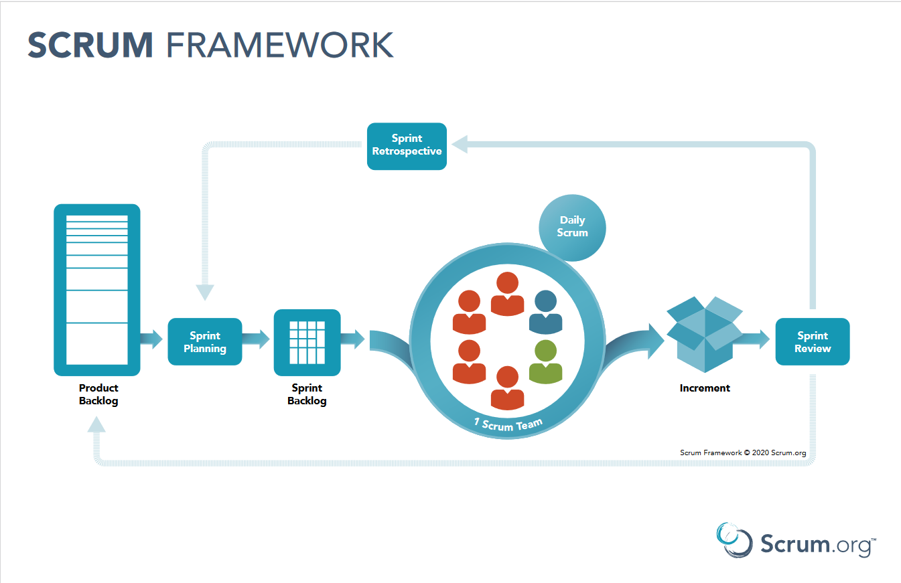
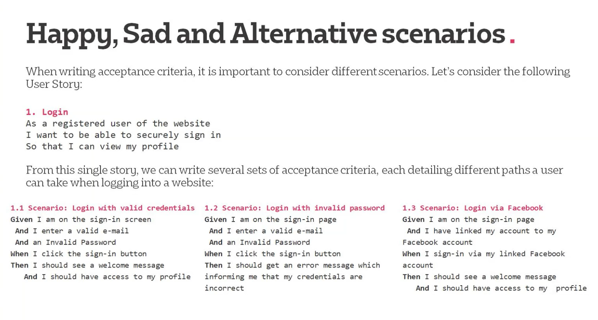
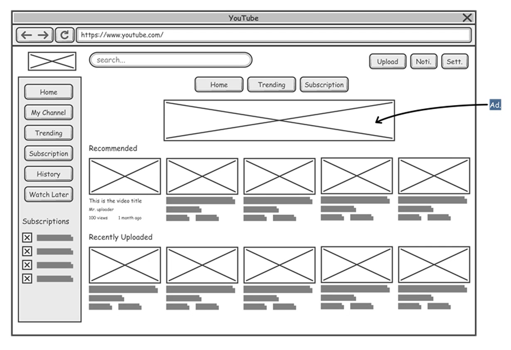

# Week 1 - Induction - Day 4

[Back](/Week_1)

[Main Menu](/README.md)

---

Date: 6/30

## Visual Studio

| Projects | Used for |
| - | - |
| Console App | create codes that are executed |
| Class library | create class and methods that are referenced |
| NUnit test project | testing |

### Creating README
Right click "CSharpIntroduction"
> Add new item
>> README.md

### Items within project
Solution 'CSharpIntroduction'
- an umbrella that contains all our codes
- serves no other purposes

CSharpIntroduction.csproj
- \<OutputType>Exe\</OutputType>
    - executable by Common Language Runtime (CLR)
    - just-in-time compilation

Program.cs
- cs = C Sharp

### Disabling implicit usings
Right-click CSharpIntroduction
> Properties
>> uncheck "Implicit global usings"

or

Double-click CSharpIntroduction
> \<ImplicitUsings>enable\</ImplicitUsings>

```csharp
using System;

namespace CSharpIntroduction
{
    public class Program
    {
        public static void Main(string[] args)
        {
            Console.WriteLine("Hello, world!");
        }
    }
}
```

| Command | Description |
| - | - |
| cw tab tab | Console.WriteLine() |
| static | static across all instances of a type |
| void | no output |
| namespace | a library that contains all classes and methods |
| System.Console.WriteLine() | namespace . class . method |

```csharp
namespace CSharpIntroduction
{
}
```
=
```csharp
namespace CSharpIntroduction;
```

Right-click CSharpIntroduction
> Add new item
>> Usings.cs

```csharp
global using System;
global using System.Collections.Generic;
global using System.Linq;
```

### C# case conventions
| Case conventions | Used for |
| - | - |
| camelCaseLikeThis | variable names |
| _underscoreFirst | private fields |
| PascalCaseLikeThis | class and method names |
| kebab-case | html |
| snake_case | SQL |

| Command | Description |
| - | - |
| ctr + k + d | unindent |

### Debug mode
- breakpoints
    - left-click the margin to the left of the line of code
- conditional breakpoints

### bin folder
- folder "Debug" created if code is run in debug mode
- folder "Release" created if code is run in release mode

| Command | Description |
| - | - |
| Search:  clean solution | everything in bin/Debug/ is deleted |
| Search:  build solution | everything in bin/Debug/ is created |

```csharp
using System;

namespace CSharpIntroduction;

public class Program
{
    public static void Main(string[] args)
    {
        //int x = 100;
        //x += 10;
        //for (int i = 0; i < 10; i++)
        //{
        //    Console.WriteLine(i);
        //    x += i;
        //}
        Console.WriteLine("Write our command line arguments");
        foreach (string item in args) 
        {
            Console.WriteLine(item);
        }
    }
}

```

### Running it in command prompt

```cmd
cd …\bin\Debug\net6.0
powershell
./CSharpIntroduction champagne supernova in the sky
```
| Command | Description |
| - | - |
| dotnet new console | generate new console app files |

### Git Changes

---

## Agile & Scrum

Agile vs Waterfall

### Agile Manifesto

We are uncovering better ways of developing
software by doing it and helping others do it.
Through this work we have come to value:

Individuals and interactions over processes and tools
Working software over comprehensive documentation
Customer collaboration over contract negotiation
Responding to change over following a plan

That is, while there is value in the items on
the right, we value the items on the left more.


What is Agile
- iterative cycle
- agile

Agile methods
- Scrum
- Kanban
- TDD (test-driven development)
    - red/green/refractor

Wouldn’t work in
- building a house/spaceship

MoSCoW method
- must have
- should have
- could have
- won't have



Three pillars of Scrum
- transparency
- inspection
- adaptability

Scrum master
- ~= project manager

https://itnove.com/wp-content/uploads/2021/07/15th-state-of-agile-report.pdf

Why Scrum
- Agile is increasingly popular
- Scrum is the most popular Agile framework
- adaptability

#### User story
- as a \<type of user>, I want \<goal> so that \<reason>
- INVEST
    - independent
    - negotiable
    - valuable
    - estimable
    - small
    - testable

| | |
| - | - |
| Feature | secure login |
| Epic | As a customer I need to login so I can access my account securely |
| User stories | As a customer I need a registration form … |

Must-have's
- features of a minimum viable product

Trello for user stories

wireframe.cc for wireframe

#### Acceptance criteria
- how do you know when a user story is completed
- checklist

Gherkin scenario
- given, when, then
- scenarios
    - happy
    - sad
    - alternative




Planning poker

Task management
- Trello
    - product backlog
    - sprint backlog
    - in progress
    - in review
    - done

"As a user,
I want to sign into my account,
so that I can buy stuff"

A.C. example:
Given I am on the signin page
When I enter my credentials
Then I should have access to my customer profile

Definition of Done (DoD)
- [ ] A.C. met
- [ ] Unit test passed
- [ ] Documentation updated
- [ ] regression test passed

Project
- definition of ready
- all user stories completed
- wireframes
    - present to business owner

---

## Wireframe



https://moqups.com/