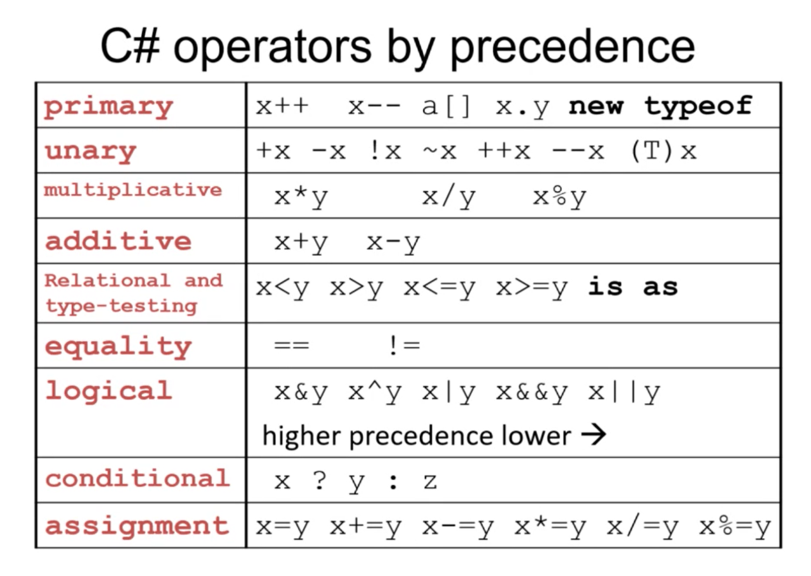
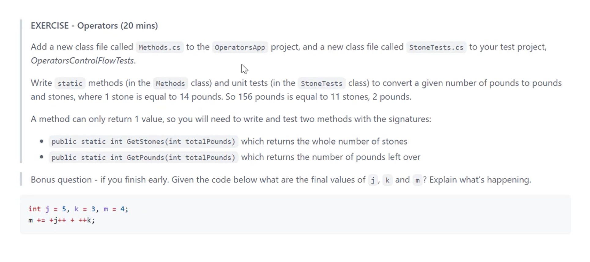

# Week 2 - C# Basics - Day 2

[Back](/Week_2)

[Main Menu](/README.md)

---
Date: 7/5

## Review

| Structure of unit test |  | Gherkin |
| - | - | - |
| Arrange | argument | Given |
| Act | method | When |
| Assert | result | Then |

List.Sum method
```csharp
Using System.LINQ;
list.Sum()
```

Collection type:  Enuerable
```csharp
return max < 0 ? 0 : Enumerable.Range(0, max + 1).Where(x => x % 2 == 0 || x % 5 == 0).Sum();
```

## 1. Operators

Creating OperatorsControlFlow
> Create new console app
>> Project name:  OperatorsApp
>>> Solution name:  OperatorsControlFlow
>>>> [x] Do not use top-level statements



| Command | Description |
| - | - |
| === | Strict equality in Java; same quality and same type |

### Using ++

```csharp
int x = 0
int y = 0
int a = x++;
int b = ++y
```
assign x to a, then increment x by 1; a = 0

assign y to b, then increment y by 1; b = 1

```csharp
for (int i = 0; i < 10; i++)
//vs
for (int i = 0; i < 10; ++i)
```
same results, no assignment involved

### Integer division

```csharp
int c = 5 / 2;
```
c = 2

### Modulo operation
a modulo n = b

n = modulus

b = remainder

### Sprinting exercise
iterating through the frames

|  |  |  |  |  |
| - | - | - | - | - |
| 0 | 1 | 2 | 3 | 4 |
| 5 | 6 | 7 | 8 | 9 | 

```csharp
const int NUM_ROWS = 2;
const int NUM_COLS = 5;
bool running = true;
int row = 0;
int col = 0;
int sprintNo = -1;

while (running)
{
	sprintNo = ++sprintNo % (NUM_ROWS * NUM_COLS);
	row = sprintNo / NUM_COLS;
	col = sprintNo % NUM_COLS;
}
```
Error without brackets

Alternative:
```
sprintNo++;
sprintNo %= (NUM_ROWS * NUM_COLS);
```

### Stones exercise


| Command | Description |
| - | - |
| internal | can be accessed within the project |

Bonus question:

assign m  to  [ m=4  +  j=5 (assign j to j+1=6)  +  (assign k to k+1=4) k=4 ]


### Logical operators

| Command | - | Description |
| - | - | - |
| && | AND | if the first operand is false, the second is ignored |
| & |  | always check all conditions; for bit-wise operations |
| \|\| | OR | if the first operand is true, the second is ignored |
| \| |  | always check all conditions; for bit-wise operations |
| ^ | XOR | symbol = caret, exclusive-or:  or, exclusive of the case when both operands are true  |
|  |  | returns True if the operands differ |

Logic gates
- AND, OR, NAND, NOR, XOR, XNOR


|  | Condition 1 | Condition 2 | Result |
| - | - | - |  |
| && | TRUE | FALSE | FALSE |
| \|\| | TRUE | FALSE | TRUE |
| ^ | TRUE | TRUE | FALSE |
| ^ | FALSE | FALSE | FALSE |
| ^ | TRUE | FALSE | TRUE |

## 2. [Control flow](https://docs.microsoft.com/en-us/dotnet/csharp/language-reference/statements/selection-statements)

## Selection statements:  if statements, switch statements

### [?: operator](https://docs.microsoft.com/en-us/dotnet/csharp/language-reference/operators/conditional-operator)

```csharp
public static void Main(string[] args)
    {
        int mark = 35;
        string grade = mark >= 65 ? "Pass" : "Fail";
        Console.WriteLine(grade);
    }
```

#### Writing tests for ControlFlowApp


`GivenMark_Grade_ReturnsPass`
- function name needs to be more explicit
- ex. Given85OrAbove_ ...

### Switch statements
Debug mode:  if/else statements
Release mode:  different

| Command | Description |
| - | - |
| switch tab tab | create switch template |
| ctr + k + u | uncomment highlighted |

```csharp
public static void Main(string[] args)
    {
        Console.WriteLine(Priority(1));
     }
    public static string Priority(int level)
    {
        string priority = "Code ";

        switch (level)
        {
            case 3:
                priority = priority + "Red";
                break;
            case 2:
            case 1:
                priority = priority + "Amber";
                break;
            case 0:
                priority = priority + "Green";
                break;
            default:
                priority = "Error";
                break;
        }
        return priority;
    }
```

Case 2 and 1 are grouped together and will return "Amber".

Default name of a new class item is the project.

`break` or `return` is necessary to get out of the switch statement.

```csharp
public static string DrivingLaws(int age)
    {
        string law = "";
        switch (age)
        {
            case int when (age < 18):
                law = "Cannot legally drive";
                break;
            case int when (age >= 18 && age < 23):
                law = "Can legally drive but cannot hire a car";
                break;
            case int when (age >= 23):
                law = "Can legally drive and rent a car";
                break;
            default:
                law = "Unknown";
                break;
        }
    }
```

**Avoid using case statements with range statements**
```csharp
public static string DrivingLaws(int age)
    {
        string law = "";
        switch (age)
        {
            case < 18:
                law = "Cannot legally drive";
                break;
            case < 23:
                law = "Can legally drive but cannot hire a car";
                break;
            default:
                law = "Can legally drive and rent a car";
                break;
        }
    }
```

### Loops

Creating a new class:
```csharp
using System;
using System.Collections.Generic;
using System.Linq;
using System.Text;
using System.Threading.Tasks;

namespace ControlFlowApp
{
    public static class LoopTypes
    {

    }
}
```

**Static class**: a static class cannot be instantiated


Creating main method
```csharp
List<int> nums = new List<int> { 10, 6, 22, -17, 3 };
        Console.WriteLine("Highest foreach loop: " + LoopTypes.HighestForEachLoop(nums));
        Console.WriteLine("Highest for- loop: " + LoopTypes.HighestForLoop(nums));
        Console.WriteLine("Highest while- loop: " + LoopTypes.HighestWhileLoop(nums));
        Console.WriteLine("Highest do-while loop: " + LoopTypes.HighestDoWhileLoop(nums));
```

> Right click
>> Quick Actions and Refractoring
>>> Generate method

LoopTypes.cs:
```csharp
namespace ControlFlowApp
{
    public static class LoopTypes
    {
        public static int HighestForEachLoop(List<int> nums)
        {
            throw new NotImplementedException();
        }
```
