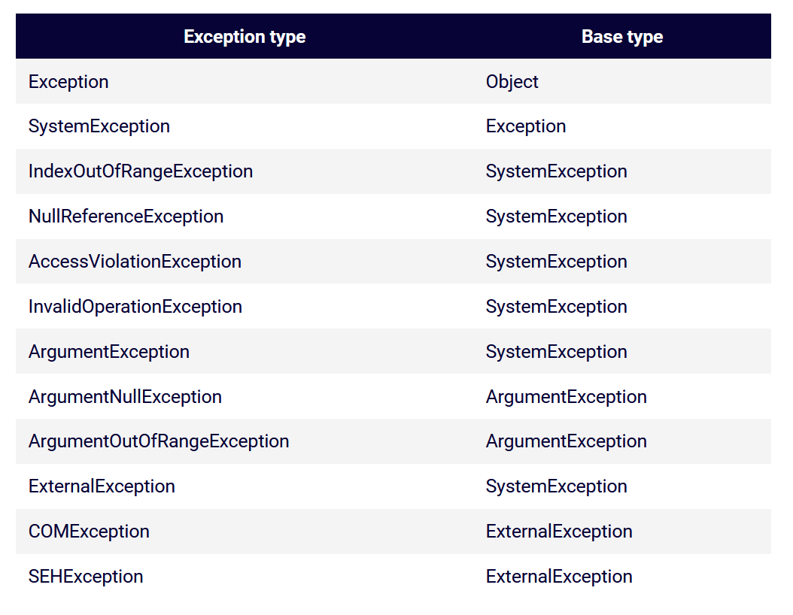
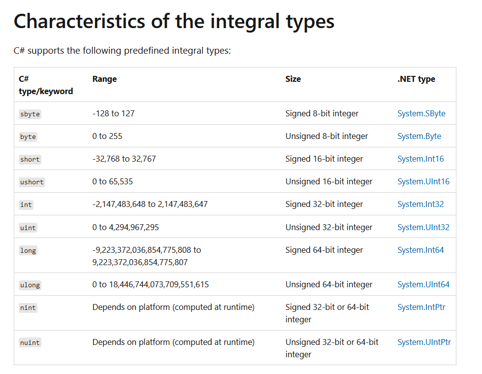
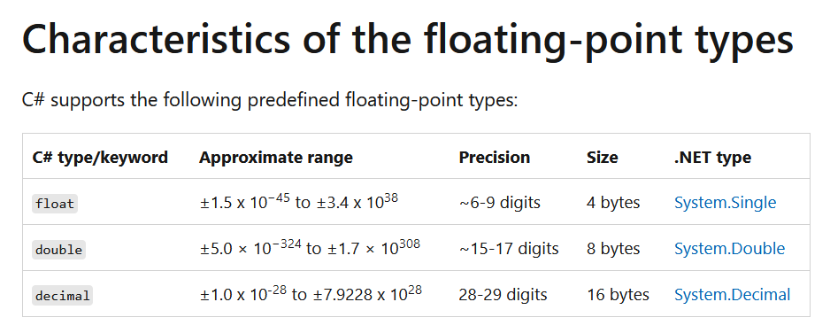
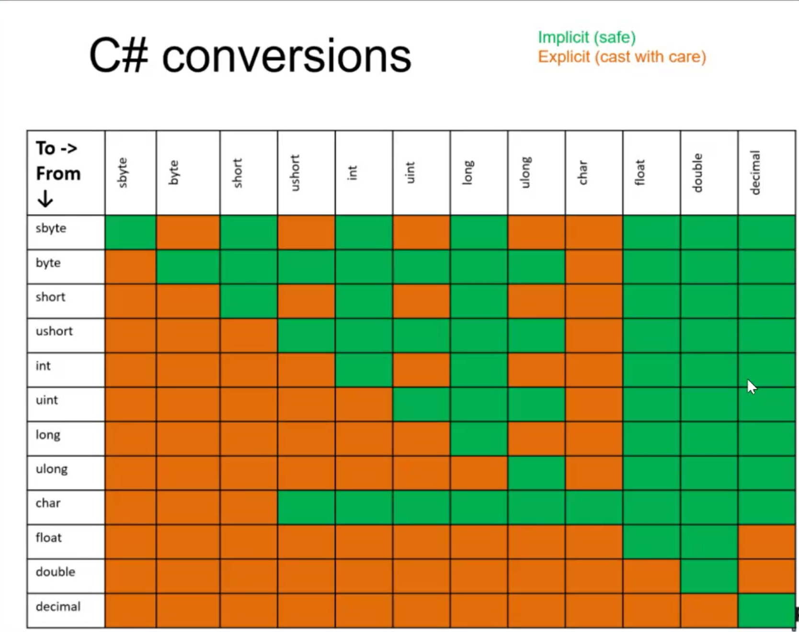

# Week 2 - C# Basics - Day 3

[Back](/Week_2)

[Main Menu](/README.md)

---
Date: 7/6

## Exceptions

Project:  ExceptionsDatatypes

> Dependencies
>> Add Project Reference
>>> [x]

In Usings.cs
```csharp
global using ExceptionsApp;
```

Exception is an error found / failure at runtime
- Everything compiles
- No syntax error

Exception examples
- index out of range
- number divided by zero

### Exception hierachy



[`throw`](https://docs.microsoft.com/en-us/dotnet/csharp/language-reference/keywords/throw#re-throwing-an-exception)
- signals the occurrence of an exception
- re-throwing an exception:
```csharp
catch
{
    throw;
}
```

```csharp
public static string Grade(int mark)
        {
            if (mark < 0 || mark > 100) return "error";
            return mark >= 65 ? (mark >= 85 ? "Distinction" : "Pass") : "Fail";
        }
```
Bad user experience

What if the method returns void or int

### Lambda
```csharp
Assert.That(() => Program.Grade(mark));
```

```csharp
Throws.InstanceOf
```
- more generic about the exceptions thrown

```csharp
Throws.TypeOf
```
- more specific

### Catching multiple exceptions
```csharp
catch ()
{
	throw;
}
catch ()
{
	
}
```
- according to exception hierachy
- from the more specific exceptions, to the less specific

### Finally
```csharp
try {}
catch {}
finally {}
```

---

## Daniel Webb

Google engineering productivity team

Opportunities moving around within a company

Advice to testers
- your mission is to test
    - what are our values?
    - do these bugs compromise those values?
- cons of following a process
bugs usually found in unexpected places

---

## Numerical data type

Describe C#
- common quality gate question

### Strongly typed language
- statically typed
    - once you define the type, you can't change it
- type safe
    - we can't assign a different type to a variable that has already been assigned to be a particular type
- memory safe
    - we are restricted in the memory we can access
- class-based

`var nish;`

`var nish = 1;` (within class, outside Main())
- both won't work

### var

```csharp
int anInt = 3;//explicitly typed
var vInt = 3; //implicitly typed

var name = "Peter";
var isClean = true;
var letter = 'p';
var uLongNum = 52uL;

var list = new List<string>();
List<string> list2 = new List<string>();
```

### Integral types



Unsigned:  without - sign


| Integral types | bit | Name |
| - | - | - |
| byte | 8 | Int8 |
| short | 16 | Int16 |
| int | 32 | Int32 |
| long | 64 | Int64 |

### Floating-point types



decimal used in finance

### Compounding small errors in loops
```csharp
float sum = 0;
for (int i = 0; i < 100_000; i++)
{
	sum += 2 / 5.0f;
}
	Console.WriteLine("2/5 added 100,000 times: " + sum);
	Console.WriteLine("2/5 multiplied 100,000: " + 2/5.0f * 100_000);
}
```

### Numerical operations with different data types
```csharp
var result = 5.0 / 5;
```
when smaller data type (5) is merged with larger data type (5.0: double), result is double

### Casting

**Casting**:  treat object A as Type X
**Conversion**:  object A isn't Type X, but create a new object from A of Type X

#### Implicit casting
```csharp
int a = 3;
double b = a;
```
- works if going from smaller to larger data type

#### Explicit casting
```csharp
int a = 3;
double b = (double)a;
```
- **cast expression** `(T)E` needed for going from larger to smaller data type
- ex.  assigning double to float
- treat Type A as Type B
- always gives you a value, but overflow can happen


### Conversion
```csharp
int a = 3;
double b = Convert.ToDouble(a);
```
- no overflow, but sometimes gives you an error

#### Invalid conversion
```csharp
var date = Convert.ToDateTime(myInt);
```



## Overflow

Nuclear gandhi

```csharp
sbyte sNum = SByte.MaxValue;
            Console.WriteLine("SByte max: " + sNum);
            sNum += 1;
            Console.WriteLine(sNum);
```
- sNum cycles from 127 to -128.


### Checking overflow
```csharp
checked
{
}
```

```csharp
int bankBalance = -2;
uint posBalance = (unit)bankBalance;
Console.WriteLine(Convert.ToString(bankBalance, 2);
Console.WriteLine(Convert.ToString(posBalance, 2);
```
bankBalance and posBalance have the same binary value

### ASCII table