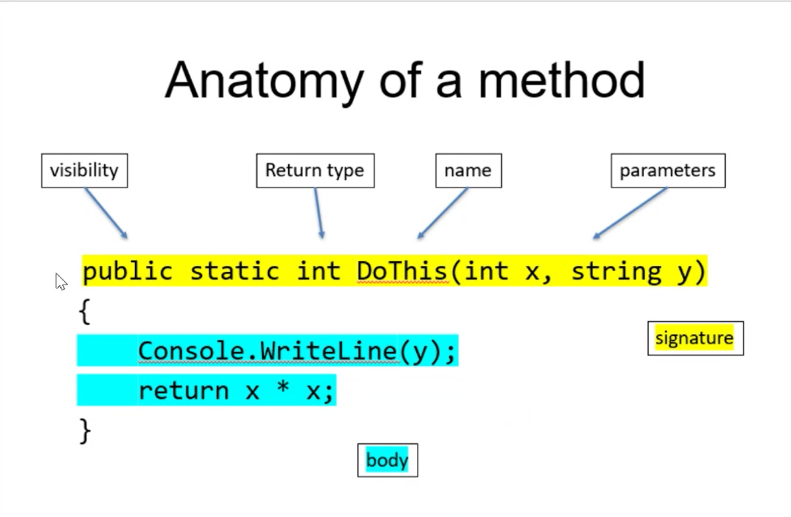

# Week 2 - C# Basics - Day 5

[Back](/Week_2)

[Main Menu](/README.md)

---
Date: 7/8

**String pool**
```
string a= "Nish"
string b = "Nish"
string c = "nish"
```
a and b uses the same memory space

**StringBuffer**

## Enum

a set of named constants whose underlying type is any integral type
a class
the user cannot make mistakes when choosing types
enums in capital letters recommended

```csharp
namespace MoreDataTypesApp
{
	public enum Pokemon
	{
		GRASS, FIRE, ELEC, WATER
	}
	internal class Program
	{
		static void Main(string[] args)
		{

			Pokemon type = Pokemon.FIRE;

			if (type == Pokemon.WATER) Console.WriteLine("Water is the type");
			else if (type == Pokemon.FIRE) Console.WriteLine("Fire is the type");

			switch (type)
			{
				case Pokemon.ELEC:
					Console.WriteLine("Bzz");
					break;
				case Pokemon.GRASS:
					Console.WriteLine("The worst type");
					break;
				case Pokemon.FIRE:
					Console.WriteLine($"Beats {Pokemon.GRASS}");
					break;
				default:
					Console.WriteLine("No type found :(");
					break;
			}

			var poke = (int)Pokemon.GRASS;
			var theType = (Pokemon)60;
			Console.WriteLine(poke);

			var anotherType = Enum.Parse(typeof(Pokemon), "WATER");
		}
	}
}
```


## Methods



| Command | Description |
| - | - |
| public | accessible from other classes |
| private | inaccessible from other classes |
| internal | accessible within the project |
| static | belongs to the class |
| (…) | a scope |
| abstract public … |  |
| sealed public … |  |
| public static async Task<string> DoThis() | doing two things at once |


```csharp
public class Program
{
    static void Main(string[] args)
    {
        Console.WriteLine("Hello, World!");
        DoThis();
    }

    private static string DoThis()
    {
        return "";
    }

}

public class Example
{
    private static string DoThat()
    {
        return Program.DoThis();
    }
}
```
Console.WriteLine ideally in the main method
Single responsibility

```csharp
static void Main(string[] args)
{
	var result = DoThis(10, "Decent");
}

private static int DoThis(int x, string y)
{
        Console.WriteLine($"I'm feeling {y}");
        return x * x;
}
```
int is a value type
string is a reference type


### Optional argument
```csharp
private static int DoThis(int x, string y = "Sad")
```
- must appear after all required parameters


### Named arguments
```csharp
var result = DoThis(y:"Happy", x:10);
```

```csharp
var spartaPizza = OrderPizza(true, true, true);
```
- confusing

```csharp
var spartaPizza = OrderPizza(pepperoni: true, chicken:true, true, true);
```
- better

| Command | Description |
| - | - |
| ctr + x | remove line |


### Method overloading
multiple methods with the same method signature but with different parameters
compile time metamorphism

```csharp
public static int Add (int num1, int num2)
{
	return num1 + num2;
}
public static int Add(int num1, int num2, int num3 = 3)
{
	return num1 + num2 + num3;
}
```

### [Tuple](https://docs.microsoft.com/en-us/archive/msdn-magazine/2018/june/csharp-tuple-trouble-why-csharp-tuples-get-to-break-the-guidelines)
can contain multiple data types

```csharp
	var myTuple = ("Kai", "Chan", 60);
	(string fName, string lName, int age) myTuple2 = ("Kai", "Chan", 60);
	var myTuple3 = (title: "Lord of the Rings", copies: 3);
	Console.WriteLine(myTuple);
	Console.WriteLine(myTuple.Item1);
	Console.WriteLine(myTuple2.lName);
	var result = ConvertPoundsToStones(78);
	var stones = result.stones;
}
	public static (int stones, int lbs) ConvertPoundsToStones(int pound)
	{
		//stones and pounds
		var stones = pound / 14;
		var lbs = pound % 14;
		return (stones, lbs);
	}
```

### [out](https://docs.microsoft.com/en-us/dotnet/csharp/language-reference/keywords/out-parameter-modifier)
causes arguments to be passed by reference
usually when returning more than 1 value
variable can be initialized within method

```csharp
static void Main(string[] args)
{
	Method1(out int a);
	Console.WriteLine(a);
}
public static void Method1(out int num)
{
	num = 10;
}
```

```csharp
bool z = false;
var result2 = DoThat(11, "Hello", out z);

}
public static int DoThat(int x, string y, out bool z)
{
	Console.WriteLine(y);
	z = (x > 10);
	return x * x;
}
```
- z is changed to true

```csharp
bool z = false;
var result2 = DoThat(11, "Hello", z);

}
public static int DoThat(int x, string y, bool z)
{
	Console.WriteLine(y);
	z = (x > 10);
	return x * x;
}
```
- z is still false
- primitive types (numbers, bool) are copied to method


### ref
The variable is referenced, not copied to method
ref vs out:  the variable must be initialized first

```csharp
static void Main(string[] args)
{
	int a = 0;
	Method1(ref a);
	Console.WriteLine(a);
}
public static void Method1(ref int num)
{
	num = 10;
}
```
- arguments still need to be declared in method?

```csharp
int number = -10;

Subtract(number);
Console.WriteLine(number);

Subtract(ref number);
Console.WriteLine(number);
}
public static void Subtract(int num)
{
	num--;
}
public static void Subtract(ref int num)
{
	num--;
}
```


### in
causes arguments to be passed by reference but ensures the argument is not modified
for performance

```csharp
static void Main(string[] args)
{
	int a = 0;
	Method1(a);
	Console.WriteLine(a);
}
public static void Method1(in int num)
{
	num = 10;
}
```
- won't work

## Memory model

**Value types** are stored direct to that variable, on the **stack**
- int
- bool
- enum
- struct

**Stacks**:  LIFO

**Referece types** are stored in the memory address on the **heap**
- string
- array
- list

**Scope**
- class scope
- method scope
- block scope
		○ i in for loop

**Garbage collector**
- identifies dead objects
- compacts heap
- cleans heap

Modern programming languages are similar
C# is like Microsoft version of Java

**Garbage collection**
- Reference variables can go out of scope or be reassigned
    - Leaving objects in memory that are not referenced by anything
- If they were left they would eventually fill up the heap memory
    - Memory leak
- Periodically the garbage collector runs to free up memory and compact the heap:
    1. Idenfity objects that are no longer referenced (dead)
    2. Free up this memory
    3. Move the live objects closer to each other to optimise space (compaction)