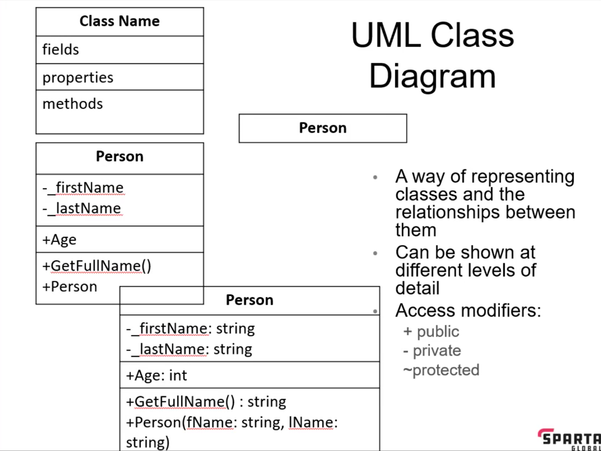
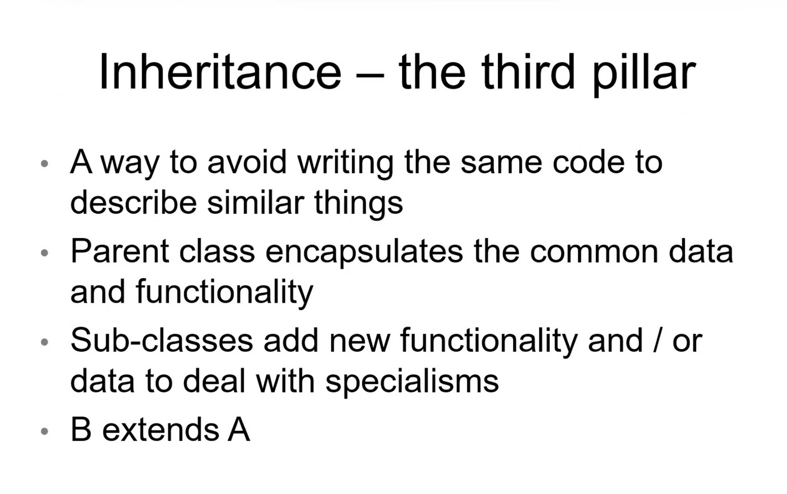
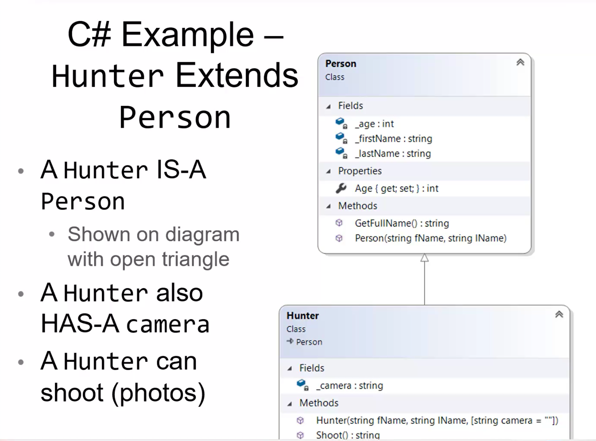
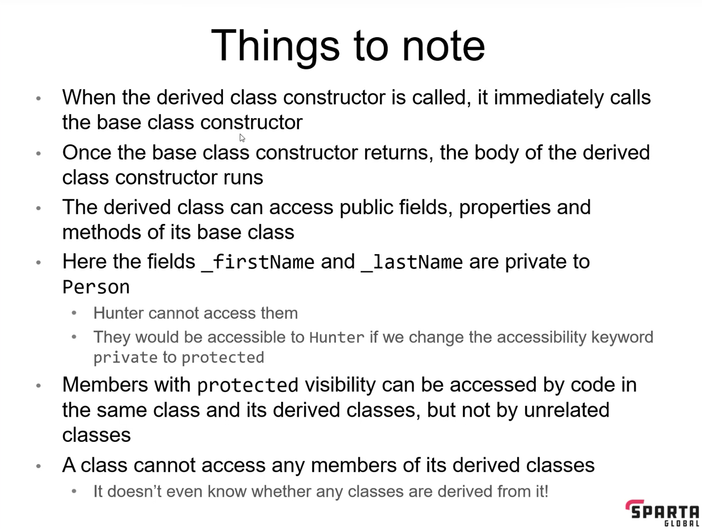

# Week 1 - OOP & Adv Unit Testing - Day 2

[Back](/Week_3)

[Main Menu](/README.md)

---
Date: 7/12


A class can have 2 constructors
- method overload


---

Good code
	- loose coupling:  responsibilities separated
	- high cohesion:  bits of code work together well

### Abstraction
- abstracting the idea of the class from which instances can be initialized

### Encapsulation
- private methods
    - ex.  car engine

### Unified Modeling Language (UML)




## SafariParkApp Project

## Class

Add a class `Person`

> Add
>> Class diagram
>>> Drag Person onto ClassDiagram


Properties and fields above constructer always

| Command | Description |
| - | - |
| ctor tab tab | create constructer |


### [Fields](https://docs.microsoft.com/en-us/dotnet/csharp/programming-guide/classes-and-structs/fields) 
A **field** is a variable of any type that is declared directly in a class or struct. 
- usually set to private to prevent data corruption
- set to public:  `public string _firstName;`

```csharp
public class Person
{
	private string _firstName;
	private string _lastName;
}
```

### [Properties](https://docs.microsoft.com/en-us/dotnet/csharp/programming-guide/classes-and-structs/properties)
A **property** is a member that provides a flexible mechanism to read, write, or compute the value of a private field.
A property definition contains declarations for a get and set accessor that retrieves and assigns the value of that property

```csharp
public class Person
{
	public int Age { get; set; };
}
```

> highlight
>> Refractoring
>>> Constructor

```csharp
static void Main(string[] args)
{
	Person jon = new Person("Jon", "Crofts", 22);
	Console.WriteLine(jon.GetFullName());
}
```

`new` calls the constructor

### Constructor
Allocates memory on the heap


### Default constructor
```csharp
static void Main(string[] args)
{
	Person peter = new Person();
}
```
Writing a parameterized constructor method will override the default constructor

```csharp
public Person (){}
```
creating a default constructor


### Default variable
```csharp
public class Person
{
	private string _firstName;
	private string _lastName = "";
	public int Age { get; set; } = 1;

	public Person(string firstName, string lastName = "", int age = 1)
	{
		_firstName = firstName;
		_lastName = lastName;
		Age = age;
	}
```
Properties vs constructor


### `Get, set` of public properties
```csharp
static void Main(string[] args)
{
	Person jon = new Person("Jon", "Crofts", 22);
	jon.Age = 23;
	Console.WriteLine(jon.Age);
}
```

| Command | Description |
| - | - |
| jon.Age = 23; | set method |
| Console.WriteLine(jon.Age); | get method |


### Full method of `{ get; set; }`
```csharp
//public int Age { get; set; } = 1;
private int _age;
public int Age
{
	get { return _age; }
	set { _age = value; }
}
```

### Control flow on properties
```csharp
public int Age
{
	get { return _age; }
	set { _age = value < 0 ? throw new ArgumentException() : value; }
}
```

### Switching from method to property
```csharp
public string GetFullName()
{
	return $"{_firstName} {_lastName}";
}
```

> Right-click GetFullName
>> Quick actions and refractorings
>>> Replace `GetFullName` with property


|  |  |
| - | - |
| two fields | only get a getter, because you can't set two values at once |
| one field | get both setter and getter |


### Switching from property to method
> Right-click GetFullName
>> Quick actions and refractorings
>>> Replace `GetFullName` with method


### Public get, private set
```csharp
public string FirstName { get; private set; }
public string LastName { get; private set; }
```
```
static void Main(string[] args)
        {
            Person jon = new Person("Jon", "Crofts", 22);
            jon.FirstName = "John";
	}
```
`jon.FirstName = "John"` won't work


### readonly private variables
```csharp
private readonly string _hairColour;
```
can only be set in the constructor


### const
```csharp
private const int numberOfFinders = 12;
```
constant


### Object initializer
```csharp
Person dan = new Person("Dan", "Summerside") { Age = 100 };
Person laba = new Person { FirstName = "Laba", LastName = "Limbu", Age = 33 };
```
eliminates the need to create many constructors
constructor overload/explosion


### Immutable property
```csharp
var kai = new Spartan(999) { FullName = "Kai", Course = "C# SDET"};
kai.Personalid = 998;
```
```csharp
public string FullName { get; set; }
public string Course { get; set; }
public int Personalid { get;  }
… method
```
**init**
```csharp
public int Personalid { get; init; }
```


## Naming Conventions

|  |  |  |
| - | - | - |
| Class | noun | PascalCase |
| Field | noun | underscore _camelCase |
| Property | noun | PascalCase |
| Method | verb | PascalCase |


## Struct
One value which can be represented in different manners
Value type, not reference type

DateTime
int:  an alias for the struct Int32

```csharp
public struct Point3d
    {
        public int x, y, z;
    }
```

### Generating constructor
> highlight
>> Quick Actions and Refractorings
>>> Generate constructor

```csharp
public struct Point3d
    {
        public int x, y, z;

        public Point3d(int x, int y, int z)
        {
            this.x = x;
            this.y = y;
            this.z = z;
        }
```

### Creating an instance of a struct
```csharp
Point3d p3d;
p3d.x = 2;
```
```csharp
Point3d pt = new Point3d(3, 6, 2);
```
An instance of a struct can be created with or without `new`, whereas that of a class must use `new`.


### Value type vs reference type
```csharp
	Point3d pt = new Point3d(3, 6, 2);
            Person jon = new Person("Jon", "Crofts", 22);
            DemoMethod(pt, jon);
        }

        public static void DemoMethod(Point3d pt, Person p)
        {
            pt.x = 100;
            p.Age = 100;
        }
```
pt.x = 3

p.Age = 100

Struct is a value type, which is stored on stack


## Testing

### Testing classes
```csharp
[TestCase("Cathy", "French", "Cathy French")]
[TestCase("", "", " ")]
public void GetFullNameTest(string firstName, string lastName, string expectedResult)
{
	Person subject = new Person(firstName, lastName);
	var result = subject.FullName;
	//Classic NUnit model
	Assert.AreEqual(expectedResult, result);
}

[Test]
public void AgeTest()
{
	var subject = new Person("A", "B") { Age = 33 };
	Assert.That(subject.Age, Is.EqualTo(33));
}
```

### Testing structs
```csharp
[Test]
public void Point3dTest()
{
	//Arrange
	var subject = new Point3d(1, 2, 3);
	//Act
	var result = subject.SumOfPoints();
	//Assert
	Assert.That(subject.x, Is.EqualTo(1));
	Assert.That(subject.y, Is.EqualTo(2));
	Assert.That(subject.z, Is.EqualTo(3));
	Assert.That(result, Is.EqualTo(6));
}
```    


## Inheritance
is a … is a … is a …





```csharp
public class Hunter : Person
```

```csharp
public Hunter(string fName, string lName, string camera = "") : base(fName, lName)
```
calling the superclass constructor to set the private fields


```csharp
Hunter maks = new Hunter("Maks", "Hadys", "Sony") { Age = 10 };
Console.WriteLine(maks.Age);
Console.WriteLine(maks.Shoot());
```
have access to public Person properties


### Access modifiers (from least accessible to most accessible)
- private
- protected
- internal
- public



### Parameterless constructor
```csharp
public Hunter() { }
```
***If we want to have a parameterless constructor in Hunter, we must have one in the base class (Person).***


```csharp
public Hunter() { } : base ("", "") {}
```


[Object Class](https://docs.microsoft.com/en-us/dotnet/api/system.object?view=net-6.0)
