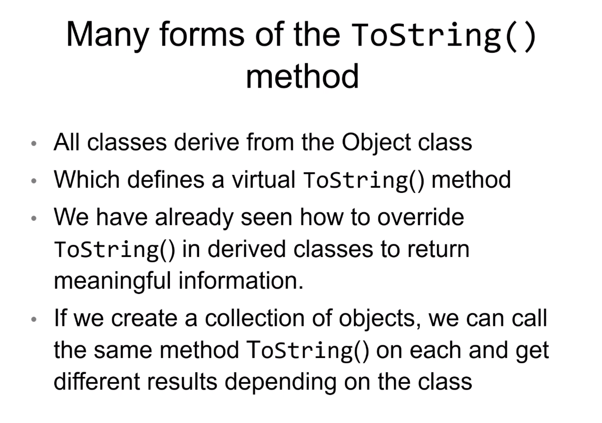
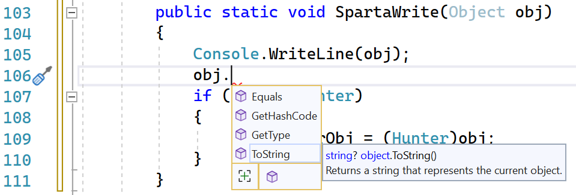
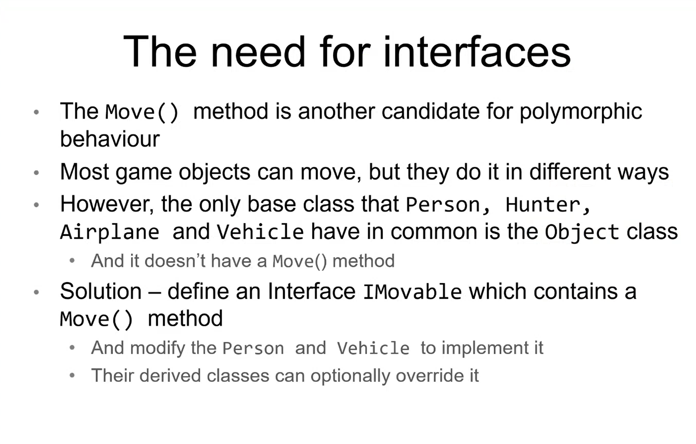

# Week 3 - OOP & Adv Unit Testing - Day 3

[Back](/Week_3)

[Main Menu](/README.md)

---
Date: 7/13

## Object Class & Its Methods

### GetHashCode()
if it's an object, hashes its reference in the memory address

```csharp
Hunter maks = new Hunter("Maks", "Hadys", "Sony") { Age = 10 };
Person dan = new Person("Dan", "Daaboul") { Age = 1 };
var maks2 = maks;

Console.WriteLine(maks.GetHashCode());
Console.WriteLine(maks2.GetHashCode());
Console.WriteLine(dan.GetHashCode());
Console.WriteLine(1.GetHashCode());
Console.WriteLine(1.GetHashCode());
```

### ToString()
Console.WriteLine calls ToString()
Best practice:  return data about the object


## [Modifiers](https://docs.microsoft.com/en-us/dotnet/csharp/language-reference/keywords/access-modifiers)

### virtual
- can be overriden by subclasses/derived classes

### override
- overrides the virtual inherited methods
- virtual and override cannot be used together

Person.cs
```csharp
public override string ToString()
{
	return $"{base.ToString()} Name: {FullName} Age: {Age}";
}
```

Hunter.cs
```csharp
public override string ToString()
        {
            return $"{base.ToString()} Camera {_camera}";
        }
```

```csharp
public class MonsterHunter : Hunter
    {
        private string? _monterHuntingWeapon;
    }
```
private string? _brand;	string can be null

| Command | Description |
| - | - |
| private string? _brand; | string can be null |


### sealed
- cannot be overriden in derived classes
- ex.  all mario carts drive the same way, with different properties

### abstract
- can have abstract and concrete/normal methods
    - abstract method has no implementation (no method body)
        - must be implemented in derived classes
    - a normal class can only have normal methods
- can be overriden in derived classes
- (all methods in an interface is purely abstract)
- cannot be instantiated

### concrete
- can only have concrete methods


**A constructor doesn't need a return type**
```csharp
public Airplance(int capacity);
```

### Test:  Set up
SetUp:  is run before every single test
One-time set up:  is run once before all the tests


## Polymorphism
Overloading
- calling different versions of method that have the same name based on the number of arguments
- 
Overriding
- methods of superclass overriden by those of subclass

Interfaces



```csharp
var ellis = new Hunter("Ellis", "Witten", "Nikon") { Age = 21 };
var plane = new Airplane(400, 200, "Virgin");
var vehicle = new Vehicle(20, 20);
var kenny = new Person("Kenny", "harvey") { Age = 22 };

List<Object> gameObjs = new List<Object> { ellis, plane, vehicle, kenny };

foreach (var gameObj in gameObjs)
{
	Console.WriteLine(gameObjs);
}
```

### Runtime polymorphism
```csharp
	SpartaWrite(ellis);
}
public static void SpartaWrite(Object obj)
{
	Console.WriteLine(obj);
}
```
Even though we have access only to Object's ToString() method, at runtime it still calls the derived class's ToString() method.

`obj` only has access to Object's methods:



### Casting
- Can cast a Hunter (ellis) to a Person/Object
- Cannot cast an Object to a Hunter/Person

```csharp
public static void SpartaWrite(Object obj)
{
	Console.WriteLine(obj);
	//if (obj is Hunter)
	//{
		var hunterObj = (Hunter)obj;
		Console.WriteLine(hunterObj.Shoot());
	//}
}
```
- Cast exception error:  if a non-Hunter is explicitly casted to the Hunter

```csharp
var ellis2 = (Person)ellis;
Console.WriteLine(ellis2.Equals(ellis));
```
- Output:  true
- Casting means **treating ellis like a Person**
- ellis2 is still ellis, same memory address

```csharp
ellis2.Age = 31;
Console.WriteLine(ellis.Age);
```
output:  31
since ellis2 is ellis


## Interface
- a contract:  if you implement the interface, then you must implement its methods
- purely abstract
- naming convention:  I …
- default public properties and public abstract methods, no need access modifiers
- In C# and Java, subclasses can only inherit from one class
- But they can have multiple interfaces




***In C#, you can only inherit from one class, but can implement multiple interfaces.***


### Liskov Substitution Principle
states that objects of a superclass should be replaceable with objects of its subclasses without breaking the application

### Creating IMovable
> Right-Click
>> Add
>>> Interface

```csharp
public interface IMovable
{
	//properties and methods - public
	string Move();
	string Move(int times);
```
- methods abstract and public

Person.cs
```csharp
public class Person :  Imovable
```
- red squiggly
> Right-click IMovable 
>> Quick Actions and Refractorings
>>> Implement interface

```csharp
Imovable sla = new Airplane( xxx)
```
***You don't instantiate abstract classes and interfaces***

Treat sla like an IMovable, not an airplane

---


|  | Abstract class | Interface |
| - | - | - |
| can have | abstract/normal methods | abstract methods only |
| each can inherit from | one class | multiple interfaces |

		
