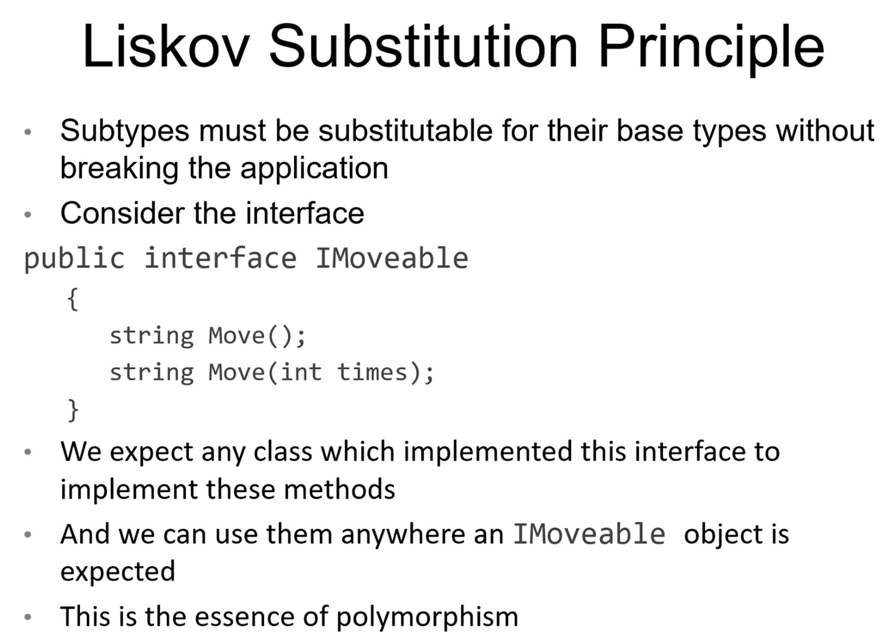

# Week 1 - OOP & Adv Unit Testing - Day 4

[Back](/Week_3)

[Main Menu](/README.md)

---
Date: 7/14

## SOLID Principles
Best practices for OOPS

### Single-responsibility principle
- every class should have only one responsibility

### Open–closed principle
- software entities should be open for extension, but closed for modification

### Liskov substitution principle
- objects of a superclass should be replaceable with objects of its subclasses without breaking the application
	
### Interface segregation principle
- many client-specific interfaces are better than one general-purpose interface

### Dependency inversion principle
- abstractions should not depend on details
- details should depend on abstractions

[Principle of least astonishment](https://en.wikipedia.org/wiki/Principle_of_least_astonishment)

Open/close
- think of inheritance

Liskov
- ex.  subtypes of an interface IShootable all shoot
- ex.  each Word version is substitutable
- principle of least surprise
- how to appropriately utilize polymorphism

Interface segregation principle
```csharp
var hare = new Hare();
List<ISingleMovable> movers = new List<ISingleMovable>
{
	ellis, plane, vehicle, kenny, hare
};
```

### Default implementation of an interface memeber
- generally not used
- ex.  same as `dynamic`
```csharp
dynamic example = 1;
example = "Nish";
example = new Hare();
```

### Dependency inversion
### Mock instance
```csharp
_calc = new Mock(ICalculator).Instance;
```

https://gist.github.com/dimabory/56e36474a1bb5573c08f26805a978fb5





## Comparing Objects
```csharp
var nish = new Person("Nish", "Mandal") { Age = 22 };
var david = nish;
Console.WriteLine(nish.Equals(david))
```
- Output:  True
- Same memory address

```csharp
var tom = new Person("Nish", "Mandal") { Age = 22 };
Console.WriteLine(nish.Equals(tom));
```
- Output:  False
- Different memory addresses


### Hash codes
```csharp
Console.WriteLine(nish.GetHashCode());
Console.WriteLine(david.GetHashCode());
Console.WriteLine(tom.GetHashCode());
```
- nish and david have the same hash codes
- tom would have a different one
***Objects are only equal if they have the same hash codes.***


```csharp
var bob = new Person("Bob", "Builder") { Age = 25 };
var people = new List<Person>
{
new Person("Cath", "Cookson"),
new Person("Bob", "Builder"){ Age = 25 },
new Person("Dan", "Dare"),
new Person("Amy", "Andrews"){ Age = 32 },
};
//Is there a person named BobBuilder in the list?
//var hasBob = people.Where(x => x.GetFullName() == "Bob Builder").Any();
//bool hasBob2 = people.Contains(bob);
```
- Output:  true, false


### IEquatable
> Right-click Person
>> Quick Actions and Refractorings
>>> Generate Equals and GetHashCode
>>>> [x] Implement IEquatable<Person>, [x] Generate operators
***Making two objects equal each other based object fields, not memory addresses***


### Equals method 1:  takes an object type, cast it to a Person
```csharp
public override bool Equals(object? obj)
{
	//(Person)obj;
	return Equals(obj as Person);
}
```

### Equals method 2:  takes a Person type
```csharp
public bool Equals(Person? other)
        {
            return other is not null &&
                   _firstName == other._firstName &&
                   _lastName == other._lastName &&
                   _age == other._age &&
                   Age == other.Age;
        }
```

```csharp
object tom = new Person("Nish", "Mandal") { Age = 22 };
object charlie = new object();
var isNish = nish.Equals(tom);
var isNish2 = nish.Equals(charlie);
```
- Tom is a person, but is treated like an object


### Hash code method
```csharp
public override int GetHashCode()
{
	return HashCode.Combine(_firstName, _lastName, _age, Age);
}
```
- takes some information and hashes it
- rather than using memory address, it uses the fields


### Boolean operator ==
```csharp
public static bool operator ==(Person? left, Person? right)
{
	return EqualityComparer<Person>.Default.Equals(left, right);
}
```
- calls the Equals method


## Sorting
```csharp
people.Sort();
```
- doesn't work


### IComparable 
- used when sorting list of objects
- implements CompareTo method

```csharp
public class Person : IEquatable<Person?>, IComparable<Person?>
```
> Right-click IComparable
>> Quick Actions and Refractorings
>>> Implement interface


### CompareTo method
```csharp
public int CompareTo(Person? other)
{
	if (other == null) return 1;
	if (this._lastName != other._lastName)
	{
		return this._lastName.CompareTo(other._lastName);
	}
	else if (this._firstName != other._firstName)
	{
		return this._firstName.CompareTo(other._firstName);
	}
	else
	{
		return this._age.CompareTo(other._age);
	}
}
```

### Sort method
```csharp
people.ForEach(x => Console.WriteLine(x.GetFullName()));
people.Sort();
Console.WriteLine();
people.ForEach(x => Console.WriteLine(x.GetFullName()));
//Less than zero, nish comes before bob
//More than zero, nish comes after bob
//zero nish and bob same position
nish.CompareTo(bob);
```
- calls the CompareTo method


### OrderBy method
```csharp
people.OrderBy(x => x.Age);
```
- can't order by private fields

---


## Lists
Collection namespace
- list
- dictionary

Arrays exist in the System namespace

### Diamond notation <>
put in the type of thing that it can hold
polymorphism:  different lists of different types


System.Collections.**Generic**
- a collection that can only hold one particular type


### GetEnumerator()
-  called when we iterate through the list


### Object initializer & other methods
```csharp
List<Person> peopleList = new List<Person>()
{ 
	new Person("Nish", "Mandal") { Age = 32 }
};
var kai = new Person("Kai", "Chan");
var tom = new Person("Tom", "W");

peopleList.Add(tom);

var newerList = new List<Person>();
newerList.AddRange(peopleList);
newerList.Add(kai);

peopleList.ForEach(x => Console.WriteLine(x));
Console.WriteLine();
newerList.ForEach(x => Console.WriteLine(x));
```


### ArrayList
- can put in different types, converting them as a generic object type

We don't recommend that you use the ArrayList class for new development. Instead, we recommend that you use the generic List<T> class. The ArrayList class is designed to hold heterogeneous collections of objects. However, it does not always offer the best performance. Instead, we recommend the following:
- For a heterogeneous collection of objects, use the List<Object> (in C#) or List(Of Object) (in Visual Basic) type.
- For a homogeneous collection of objects, use the List<T> class.


```csharp
using System.Collections;
```

### Boxing and unboxing
- converting items into a generic object type
```csharp
ArrayList al = new ArrayList();
al.Add(1);
al.Add(kai);
al.Add("Hello");
foreach (var item in al)
{
	Console.WriteLine(item);
}

int i = 100;
//Boxing
object i2 = i;
//Unboxing
int a = (int)i2;
```


### List exercise

```csharp
List<int> intList = new List<int>() { 5, 4, 3, 9, 0 };
intList.Add(8);
intList.Sort();
intList.RemoveRange(1, 2);
intList.Reverse();
intList.Remove(9);
foreach (int i in intList)
Console.Write(i + " ");
```


## Linked list


Items not stored next to each other like a list, but linked together

No IListInterface
- cannot access value by indexing

Can add items to the start or the end of the linked list
- AddFirst()
- AddLast()

Advantages
- when accessing an element is important, fast 0-1 operation
- don't require a contiguous block of memory
		○ reduce memory fragmentation
- when you frequently add/delete stuff at the start/end of list

```csharp
var linkedList = new LinkedList<Person>();
```
> Right-click LinkedList
>> Go to definition
- IListInterface is missing


```csharp
Console.WriteLine("LinkedList of People");
var linkedList = new LinkedList<Person>();
linkedList.AddFirst(kai);
linkedList.AddLast(tom);
//linkedList[0];    //won't work:
var tommy = linkedList.Find(tom).Value;
Console.WriteLine(linkedList.Find(tom).Value);
foreach (var item in linkedList)
{
	Console.WriteLine(item);
}
```


