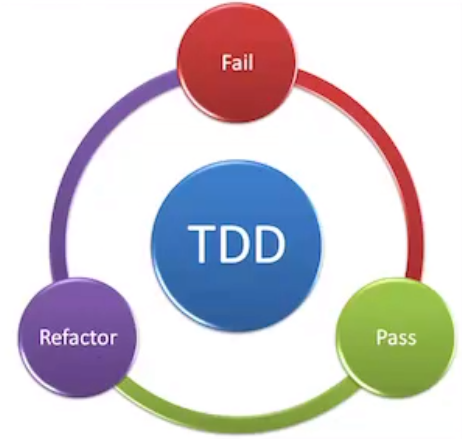

# Week 4 - Advanced C# & Data - Day 1

[Back](/Week_4)

[Main Menu](/README.md)

---
Date: 7/18

## [NUnit Attributes](https://docs.nunit.org/articles/nunit/writing-tests/attributes.html)

Constructor runs only once before the set-up and all tests
Tests run not in order


### [TestFixture]
- marks a class that contains tests


### [SetUp]
```csharp
[SetUp]
public void Setup() { }
```
run before every test

### [OneTimeSetUp]
```csharp
[OneTimeSetUp]
public void OneTimeSetUp()
{
//test one object in many methods
}
```

### [TearDown]
- run after each test

### [OneTimeTearDown]
- run after all tests

### [Ignore("message")]
- can be on individual tests as well

```csharp
private Counter _sut = new Counter(6);

[Test]
public void Increment_IncreaseCountByOne()
{
_sut.Increment();
Assert.That(_sut.Count, Is.EqualTo(7));
}
[Test]
public void Decrement_DecreasesCountByOne()
{
_sut.Decrement();
Assert.That(_sut.Count, Is.EqualTo(5));
}
```

```csharp
private Counter _sut;

[SetUp]
public void Instantiate_SUT()
{
	_sut = new Counter(6);
}
```

Better
```csharp
public void CreateNewCounter()
{
	_sut = new Counter(6);
}

[Test]
public void Increment_IncreaseCountByOne()
{
	CreateNewCounter();
	_sut.Increment();
	Assert.That(_sut.Count, Is.EqualTo(7));
}
[Test]
public void Decrement_DecreasesCountByOne()
{
	CreateNewCounter();
	_sut.Decrement();
	Assert.That(_sut.Count, Is.EqualTo(5));
}
```

https://docs.nunit.org/articles/nunit/writing-tests/attributes/order.html
https://docs.microsoft.com/en-us/dotnet/core/testing/unit-testing-best-practices#characteristics-of-a-good-unit-test


**F**ast
**I**ndependent:  each test is independent
**R**epeatable:  not dependent on a network or database
**S**elf-validating:  using asserts, no need to check results
**T**imely:  doesn't take too long to write the tests


### [Category("Happy Path")]
```csharp
[Test]
[Category("Error Path")]
public void GivenZero_Divide_ThrowsException()
{
	var subject = new Calculator { Num1 = 2, Num2 = 0 };
	Assert.That(() => subject.Divide(), Throws.TypeOf<System.ArgumentException>().With.Message.Contain("Can't divide by zero"));
}
```


### [TestCaseSource("")]
```csharp
[TestCaseSource("AddCases")]
[Category("Happy Path")]
public void Add_Always_ReturnsExpectedResult(int x, int y, int expResult)
{
	// Arrange
	//var expectedResult = 6;
	var subject = new Calculator { Num1 = x, Num2 = y };
	// Act
	var result = subject.Add();
	// Assert
	Assert.That(result, Is.EqualTo(expResult), "optional failure message");
}

private static object[] AddCases =
{
	new int[] {2, 4, 6},
	new int[] {-2, 4, 2}
};
```
like TestCase, but can instantiate and pass in objects


## Test-Driven Development (TDD)

### Why unit testing?
- make sure the code is well tested
- documentation:  tells you what the code does
- can be used for regression testing

Red, green, refactor




https://docs.nunit.org/articles/vs-test-adapter/Index.html

TDD helps ensure you abide by YAGNI


### FizzBuzzApp

> Tools
>> NUnit Package Manager
>>> Manage NUnit Packages for Solution
>>>> Install `NUnit` and `NUnit3TestAdapter`

```csharp
using NUnit .Framework;
```

`FizzBuzz(30)`
should return
1 2 Fizz 4 Buzz Fizz 7 8 Fizz Buzz 11 Fizz 13 14 FizzBuzz 16 17
 Fizz 19 Buzz Fizz 22 23 Fizz Buzz 26 Fizz 28 29 FizzBuzz

Be more specific about the particular function that you're testing
- for loop
- returning "fizz" for the numbers divisible by 3


    GivenANumberNotDivisibleBy3Or5_FizzBuzz_ReturnsItsString
​
    Split
​
    Split(" ") then count Where(x => x.Contains("Fizz")


### TDD advantage
- minimal
- high test coverage
- less bugs
- less debugging

### TDD disadvantage
- slow progress
- if requirements are updated, tests need to be updated as well
