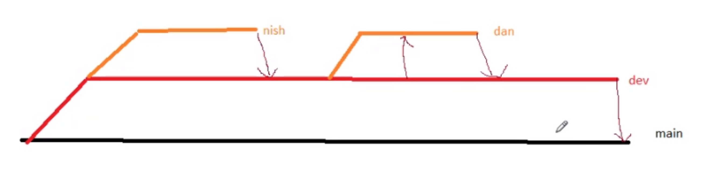

# Week 4 - Advanced C# & Data - Day 2

[Back](/Week_4)

[Main Menu](/README.md)

---
Date: 7/19

## GitHub Collaborations



| Command | Description |
| - | - |
| git clone https://... | clone remote repository to local folder |
| git branch | list branches |
| git branch -a | list all local and remote branches |
| git branch [branch name] | create a new branch |
| git branch -d [branch name] | delete a branch |
| git checkout -b [branch name] | create a new branch and switch to it |
| git checkout [branch name] | switch to a branch |
| git switch [branch name] |  |
| dotnet new console | new console app |
| git add . | stage changes |
| git commit --m "Updated" | commit changes |
| git push | push changes to remote repository; origin means remote repository |

TypeDown

Branch protection rule

Setting default branch to dev, not main
- avoid deleting the main branch accidentally


### Pushing changes and creating pull request
```powershell
git branch
git checkout -b nish_signin
git add .
git commit --m "Sign in feature nearly implemented
git push
git push --set-upstream origin nish_signin
```


GitHub website
> compare and pull request
>> create pull request

Approving changes

### Merging
- choose two branches to see what's changed
- merge locally rather than on GitHub

| Command | Description |
| - | - |
| git merge [branch name] | merge a branch into the active branch |
| git merge [source branch] [target branch] | merge a branch into a target branch |

### Sharing & Updating Projects

| Command | Description |
| - | - |
| git push origin [branch name] | push a branch to your remote repository |
| git push -u origin [branch name] | push changes to remote repository (and remember the branch) |
| git push | push changes to remote repository (remembered branch) |
| git pull | update local repository to the newest commit |
| git pull origin [branch name] | pull changes from remote repository |
