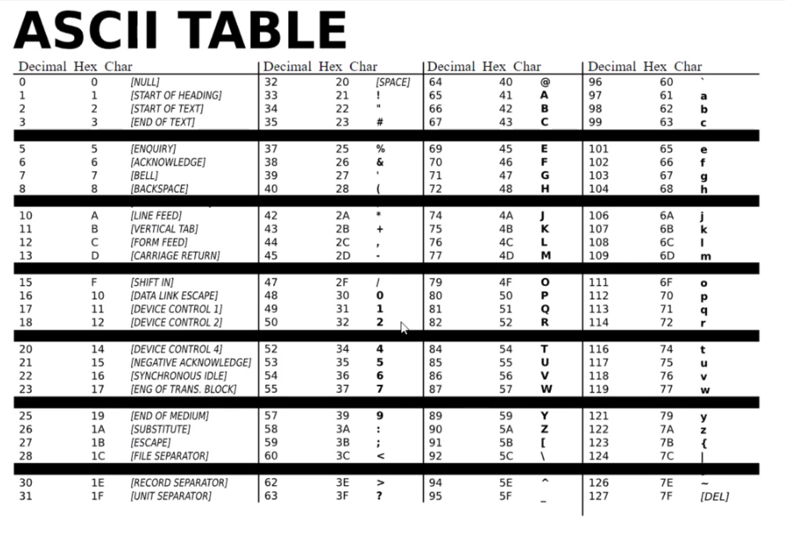
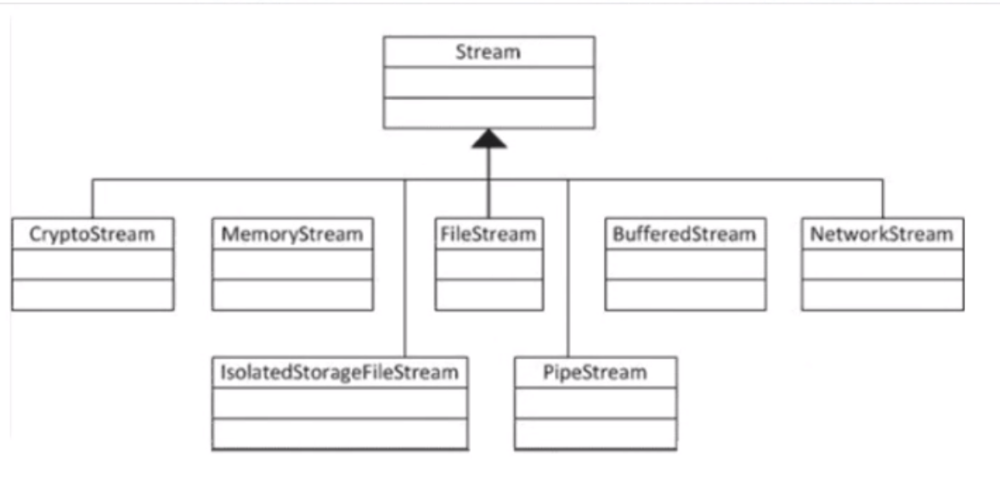

# Week 4 - Advanced C# & Data - Day 5

[Back](/Week_4)

[Main Menu](/README.md)

---
Date: 7/22

## XML and JSON
- human readable and machine readable

https://xmlwriter.net/xml_guide/xml_declaration.shtml
https://www.w3schools.com/xml/xml_dtd.asp


## LoggingStreamingEncoding

disable implicit usings
```csharp
using System;
using System.IO;
```

## File operations

### Creating a text file
```csharp
var text = "Hello, world!";
File.WriteAllText("Hello.txt", text);
```
- saved in `Debug` folder

> Right-click `WriteAllText`
>> Go to definition
- Async means doing multiple tasks simultaneously


### Saving file in specific directory
```csharp
ing currentDirectory = Directory.GetCurrentDirectory();
var path = Path.Combine(currentDirectory, @"..\..\..\");
```

### Writing    
```csharp
var text = "Hello, world!";
File.WriteAllText(path + "Hello.txt", text);
```

### Reading:  as string
```csharp
string content = File.ReadAllText(path + "Hello.txt");
Console.WriteLine(content);
```

### Reading:  as array of strings
```csharp
string[] lines = { "And after all", "You're my Wonderwall", "I Said maybe!" };
File.WriteAllLines(path + "Wonderwall.txt", lines);
string[] readLines = File.ReadAllLines(path + "Wonderwall.txt");
foreach (var item in readLines)
{
	Console.WriteLine(item);
}
```

## Logging
```csharp
int total = 0;
for (int i = 0; i <= 3; i++)
{
	Console.WriteLine(i);
	total += i;
	//Useful to find defect
	Debug.WriteLine($"Debug - The value of i is {i}");
	//Similar to debug - runs on seperate thread - monitor performance
	Trace.WriteLine($"Trace - The value of i is {i}");
}
```


### Conditionally compiling code
```csharp
#define TEST
…
	Console.WriteLine("Starting app");
#if TEST
	Console.WriteLine("This is debug code");
#endif
	Console.WriteLine("Finishing app");
```
- difficult to maintain


## Encoding
- to machine language

Powershell
```powershell
C:\Windows\System32> Format-Hex LsaIso.exe
```

### ASCII
- 7 bits
- 127 numbers

ASCII (7 BIT)
Byte (UTF-8)
2 Byte (UTF-16)




## Streaming


StreamWriter

StreamReader

TextWriter

TextReader

```csharp
//creating a stream from console application to directory
using (StreamWriter sw = File.AppendText(_path + "Mary.txt"))
{
	sw.WriteLine("Mary had a little lamb");
}
            
//from directory to console application
using (StreamReader sr = File.OpenText(_path + "Mary.txt"))
{
	string s = "";
	while ((s = sr.ReadLine()) != null)
	{
		Console.WriteLine();
	}
}

using (Stream ns = NetworkStream(clientSocket, true), bufStream = new BufferedStream(ns, 2014))
{
	//do something
}
```

- StreamReader implements IDisposable, which closes the stream
- IDisposable:  has one method - Dispose
- after the curly braces, Dispose is called and it ends the stream

