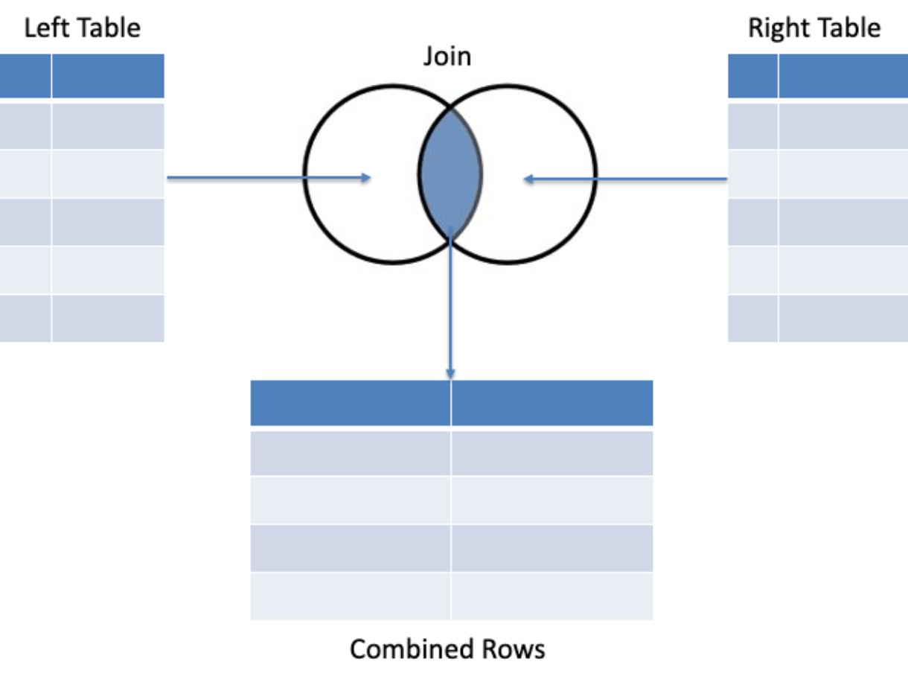
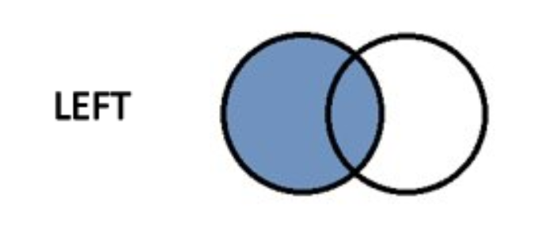
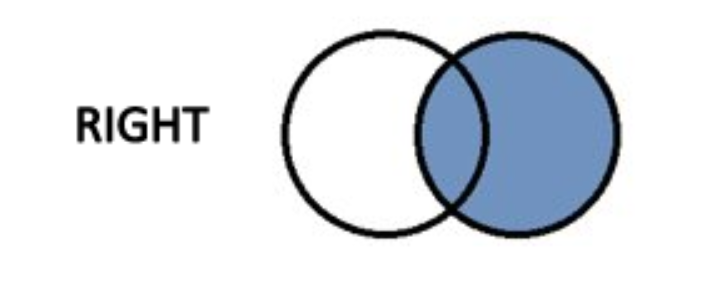
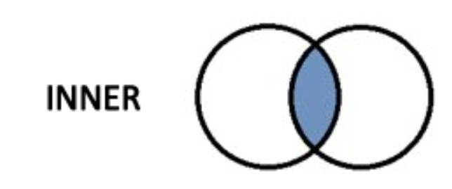
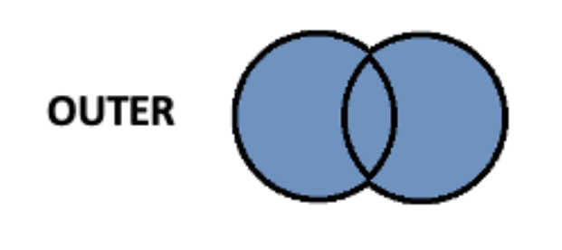
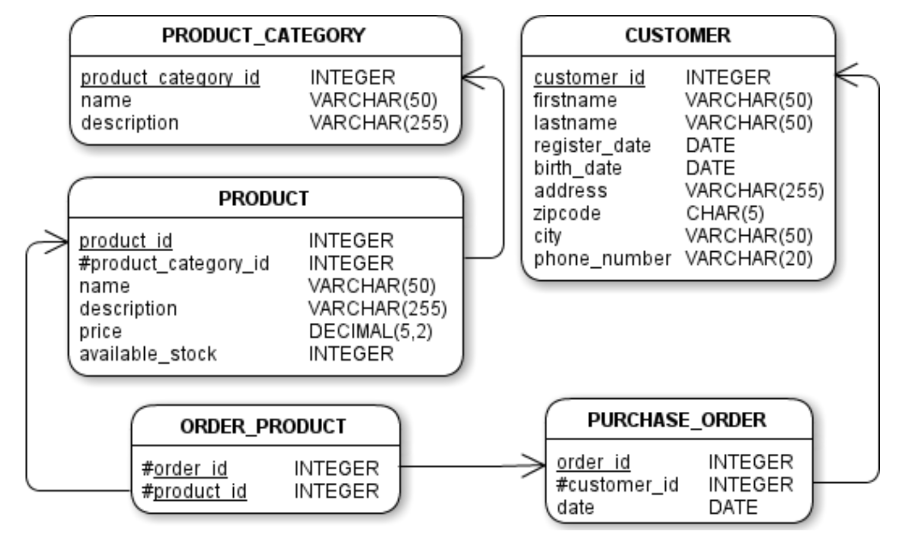

# Week 5 - ISTQB - Day 1

[Back](/Week_5)

[Main Menu](/README.md)

---
Date: 7/25

## Contents

https://www.codingame.com/evaluate/?id=5505666540bf82ad6a64beb51128d51040f70de


## SQL
- "S-Q-L" or "sequel"
- case insensitive
- space doesn't matter
- `;` if multiple commands
- double quote for header


## Select statements
```SQL
SELECT column
FROM table;
```

### Select statement sequences
### Logical sequence / syntax sequence

- SELECT
- DISTINCT
- FROM
- WHERE
- GROUP BY
- HAVING
- ORDER BY

### Processing sequence
- FROM
- WHERE
- GROUP BY
- HAVING
- SELECT
- DISTINCT
- ORDER BY

```SQL
SELECT DISTINCT pc.name, AVG(pr.price) AS "Average Price"
FROM product pr
    JOIN product_category pc
    ON pr.product_category_id = pc.product_category_id
WHERE pr.name LIKE '%0%'
GROUP BY pc.product_category_id
HAVING AVG(pr.price) > 100
ORDER BY pc.name ASC
```


### SELECT
- specific which columns we want the query to return

```SQL
SELECT column1, column2, column3
FROM table1;
```

### AS
```SQL
SELECT phone_number AS "Phone Number"
FROM customer;
```
- double quote

### *
```SQL
SELECT *
FROM customer;
```
- returns all columns


### WHERE
```SQL
SELECT *
FROM product
WHERE name = 'Chromecast';
```
- returns results for products where the name field is exactly equal to 'Chromecast'
- in single quotes
- requires a conditional statement


### Comparison Operators
<, <=
>, >=
=, !=


### Multiple Comparisons
AND, OR
```SQL
WHERE lastname = 'WHITE' OR 'WILLIAMS';
```
- does not work


## Wildcards

### LIKE
```SQL
SELECT *
FROM customer
WHERE firstname LIKE 'Li_a';
```
_
- substitudes a single character
- would find customers like Lisa, Liza, Lita, etc

### %
- substitutes for zero or more characters

### [ABC]
```SQL
SELECT *
FROM product
WHERE name LIKE 'Kindle First [567]';
```
- specifies multiple possible character to match
- will return results for Kindle Fire 5, Kindle Fire 6, and Kindle Fire 7

### [^ABC]
- negates characters in a square bracket


### Between
```SQL
SELECT *
FROM product
WHERE price BETWEEN 50 and 100;
```

### In
```SQL
SELECT *
FROM product
WHERE firstname IN ('James', 'Roger', 'Jean-Claude');
```


### Null
```SQL
WHERE birth_date = NULL;
```
- won't work

```SQL
WHERE birth_date IS NULL;
```
```SQL
WHERE birth_date IS NOT NULL;
```
- NULL is not equal to zero
- NULL is not equal to an empty string ('')
- there is nothing that is equal to NULL
- even NULL is not equal to NULL


### TOP
```SQL
SELECT TOP 5 *
FROM customer;
```
- returns a subset of the rows
- if we use TOP without ORDER BY, rows returned are arbitrary 

### ORDER BY
```SQL
SELECT TOP 5 *
FROM customer
ORDER BY lastname ASC, firstname ASC;
```
- ASC:  ascending
- DESC:  descending


### DISTINCT
```SQL
SELECT DISCTINCT lastname
FROM customer;
```
- does not return duplicate rows


### Concatenation
```SQL
SELECT firstname + ' ' + lastname AS 'Full Name'
FROM customer;
```
ANSI SQL
```SQL
SELECT firstname || ' ' || lastname AS 'Full Name'
FROM customer;
```
- no column header without specifying aliases


## String Functions

UPPER

LOWER

TRIM

LTRIM

RTRIM

LENGTH

LEFT(text, N)
- returns the leftmost N characters

RIGHT(text, N)
- returns the rightmost N characters

SUBSTRING(text, start_index, length)

POSITION('substring' IN text)


## Arithmetic

\+ - * / %


## Date Functions

International Standard format:
YYYY-MM-DD

When time is included:
YYYY-MM-DD hh:mm:ss.s

GETDATE()

DATEADD(unit, N, date)

DATEDIFF(unit, date1, date2)

YEAR(date)
MONTH(date)
DAY(date)


## CASE
```SQL
SELECT name, price,
	CASE
		WHEN price < 50 THEN 'CHEAP'
		WHEN price < 100 THEN 'Moderately Priced'
		ELSE 'Expensive'
	END AS "Price Category"
FROM product;
```
- creating a new column based on certain conditions
- comma needed, part of SELECT(?)


## Aggregation
```SQL
SELECT SUM(available_stock) AS "Total Stock",
		AVG(available_stock) AS "Average Stock",
		MIN(available_stock) AS "Minimum Stock",
		MAX(available_stock) AS "Maximum Stock",
		COUNT(available_stock) AS "Number of Products with Non-Null Stock"
FROM product;
```
SUM()
AVG()
MIN()
MAX()
COUNT()
- creating a new column, identical values if GROUP BY is not used

### GROUP BY
```SQL
SELECT product_category_id AS "Category ID",
		AVG(price) AS "Average Price",
		COUNT(name) AS "Number of Products"
FROM product
GROUP BY product_category_id;
```
```SQL
SELECT city AS "City", COUNT(customer_id) AS "Customer Count"
FROM customer
GROUP BY city
ORDER BY COUNT(customer_id) DESC, city 
```
- used in conjunction with aggregate functions
- specify a column with which to group our data, instead of aggregating over the entire table
- can group by multiple columns; list them separated by commas
- whenever you use aggregation or grouping, everything in SELECT has to be aggregated or grouped


### HAVING
```SQL
SELECT product_category_id AS "Category ID",
		AVG(price) AS "Average Price",
FROM product
WHERE product_category_id IS NOT NULL
GROUP BY product_category_id
HAVING AVG(price) < 200;
```
- HAVING:  to filter based on aggregation
- WHERE:  to filter rows in original table
- cannot use "Average Price" alias


## FROM:  JOIN






```SQL
SELECT *
FROM LeftTable
LEFT JOIN RightTable
ON LeftTable.KeyColumn = RightTable.KeyColumn
```





```SQL
SELECT *
FROM LeftTable
INNER JOIN RightTable
ON LeftTable.KeyColumn = RightTable.KeyColumn
```


### Table Aliases
```SQL
SELECT s.firstname, c.coursename
FROM student s
INNER JOIN course c
ON s.course_id = c.id
```

### Multiple Joins

### Entity Relationship Diagram (ERD)

```SQL
SELECT *
FROM Table_1 t1
JOIN Table_2 t2
	ON t1.id = t2.id
JOIN Table_3 t3
	ON t1.id = t3.id
```
```SQL
SELECT *
FROM Table_1 t1
JOIN Table_2 t2
	ON t1.id = t2.id
JOIN Table_3 t3
	ON t2.id = t3.id
```


## Subqueries

### SELECT Subqueries
```SQL
SELECT name, price, (SELECT MAX(price) FROM product) AS "Maximum Price"
FROM product
```
```SQL
SELECT name, price, price/(SELECT MIN(price) FROM product) AS "Maximum Price"
FROM product
```

- always return the same value
- often used to return a reference value


### FROM Subqueries
```SQL
SELECT AVG("Total Price") AS "Average Category Total"
FROM (
	SELECT product_category_id AS "Category ID",
		SUM(price) AS "Total Price"
	FROM product
	GROUP BY product_category_id
);
```
- useful if we want to perform further calculations on top of previous aggregations or calculations
```SQL
SELECT name, price, available_stock, price*available_stock / stock_value AS "CATEGORY VALUE PROPORTION"
FROM product p
JOIN (
	SELECT product_category_id, SUM(price*available_stock) AS stock_value
	FROM producct
	GROUP BY product_category_id
) sv on p.pproduct_category_id = sv.product_category_id;
```


### WHERE Subqueries
```SQL
SELECT name
FROM product
WHERE product_id IN (
	SELECT DISTINCT product_id
	FROM order_product
);
```


## UNION
```SQL
SELECT firstname AS "First Name", lastname AS "Last Name"
FROM customer
UNION
SELECT firstname, lastname
FROM employee;
```
- JOIN:  join rows from different tables together horizontally
- UNION:  join columns together vertically
- UNION will not return duplicate rows
- UNION ALL will return duplicate rows


