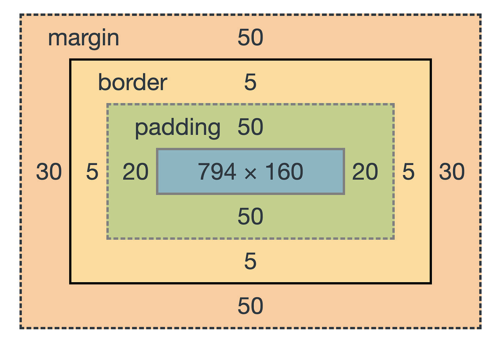
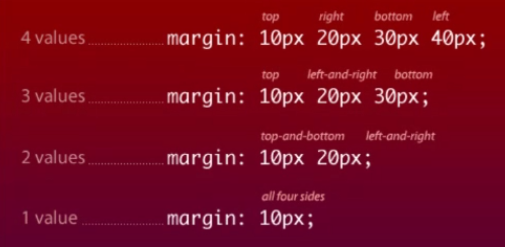

# Week 7 - Web Testing - Day 2

[Back](/Week_7)

[Main Menu](/README.md)

---
Date: 8/9

## HTML

| Language | For | Like |
| - | - | - |
| html | content | skeleton |
| css | appearance | flesh |
| JavaScript | client site authentication | nervous system |


https://elliswitten.github.io/bootstrap-4-cv/index.html

| Command | Description |
| - | - |
| ctr + k, ctr + f | prettify |

Document object model
- an API for HTML and XML documents
- treating those documents like an object
- deserialization of XML abides by the DOM


### HTML declaration
```html
<!DOCTYPE html>
```

### Meta
- tells other computers about technical data
```html
<meta charset="utf-8" />
<title>My Profile</title>
<meta charset="utf-8">
<meta name="author" content="A. Trainer">
<meta name="description" content="This is a wonderful webpage">
```

### Header
```html
<h1></h1>
<h2></h2>
```

### Paragraph
```html
<p></p>
```

### Emphasis
```html
<em></em>
```

### Bold
```html
<strong></strong>
```


### Ordered list
```html
<ol>
	<li></li>
	<li></li>
</ol>
```

### Unordered list
```html
<ul></ul>
```

### Anchor, hyperlink reference
```html
<a href="#"></a>
```
- #:  top of current page

### Division
```html
<div></div>
```


### Non-semantic elements
- gives no no meaning or role to the text
- provide structure and meaning


### Semantic elements


### Horizontal rule
```html
<hr></hr>
```

### Image
```html

```

```html
<small>Copyright &#169; Sparta Global 2022<cite> by N. Mandal</cite></small>
```


### Search bar
```html
<section>
	<h3>News Search</h3>
	<form action="https://www.bbc.co.uk/search">
		<label for="mysearch">Search for:</label>
		<input id="text" name="q" type="text" value="Manchester">
		<input class="button" type="submit" value="submit">
	</form>
</section>
```


### projects.html
```html
<body>
    <div>
        <h1>Projects</h1>
        <table>
            <thead>
                <tr>
                    <td>Name of Project</td>
                    <td>description</td>
                    <td>Year</td>
                </tr>
            </thead>
            <tbody>
                <tr>
                    <td>Agile Project</td>
                    <td>Did stuff with user stories</td>
                    <td>2022</td>
                </tr>
                <tr>
                    <td>API testing</td>
                    <td>Tested APIs</td>
                    <td>2022</td>
                </tr>
            </tbody>
            </thead>
        </table>
    </div>
</body>
```

### Style:  individually
```html
<ol>
	<li style="color:aqua"><a href="#">Testing</a></li>
	<li><a href="#">More Testing</a></li>  
	<li><a href="#">Nothing but testing</a></li> 
</ol>
```

### Style:  in header
```html
<head>
	<meta charset="utf-8" />
	<title>My Profile</title>
	<meta charset="utf-8">
	<meta name="author" content="A. Trainer">
	<meta name="description" content="This is a wonderful webpage">
	<link rel="stylesheet" href="profileStyles.css">
	<style>
		li{
			background-color: #eee;
			color: #92d;
		}
	</style>
</head>
```


## CSS
Cascading Style Sheets
- styles are applied in priority order

1. browser default
2. styles defined
3. inline styles

- style code interpreted by a browser
- not by a compiler
- same as Python


```html
<head>
	<meta charset="utf-8" />
	<title>My Profile</title>
	<meta charset="utf-8">
	<meta name="author" content="A. Trainer">
	<meta name="description" content="This is a wonderful webpage">
	<link rel="stylesheet" href="profileStyles.css">
	<style>
		li{
			background-color: #eee;
			color: #92d;
		}
	</style>
</head>
```

### Fonts
```css
font-family: Arial, Helvetica, sans-serif;
```
- if Arial is not available, Helvetica will be used instead, and so on


### Importing fonts from Google
https://fonts.google.com/
copy code into header


### Targeting elements
```css
h1{
    color: #ff0000;
}
```

### Targeting classes
```css
.box-2{
    background-color: wheat;
    border: 5px rebeccapurple solid;
}
```
- dot for class name

Id's for unique elements


### Targeting elements within a class
```css
.box-1 h4{
    font-family:'Segoe UI', Tahoma, Geneva, Verdana, sans-serif
    font-weight: 800;
    text-decoration: underline;
    text-transform: uppercase;
    letter-spacing: 0.1em;
}
```

### Targeting anchor
```css
a{
    text-decoration: none;
    color: black;
}
a:hover{
    color: red;
}
a:active{
    color: aquamarine;
}
```

### Targeting a class with id
```css
<nav id="mainNav">
```
```css
nav#mainNav{
    background-color: beige;
}
```

### Flex container
```css
.flex-container{
    display: flex;
    flex-direction: row;
    justify-content: center;
}
```

### Box model




```css
.box-1{
    background-color: whitesmoke;
    border-top: 5px red solid;
    border-bottom: 5px red solid;
    border-right: 5px red solid;
    border-left: 5px red solid;
    border-style: ridge;
}
.box-2{
    background-color: wheat;
    border: 5px rebeccapurple solid;
}
```


## Bootstrap

https://www.w3schools.com/whatis/whatis_bootstrap.asp
https://getbootstrap.com/docs/5.2/getting-started/introduction/

```html
<linkhref="https://cdn.jsdelivr.net/npm/bootstrap@5.2.0/dist/css/bootstrap.min.css"rel="stylesheet"integrity="sha384-gH2yIJqKdNHPEq0n4Mqa/HGKIhSkIHeL5AyhkYV8i59U5AR6csBvApHHNl/vI1Bx"crossorigin="anonymous">
```
From <https://getbootstrap.com/docs/5.2/getting-started/introduction/> 


